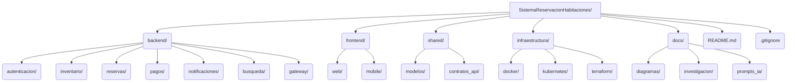

```mermaid
graph TD
    A[SistemaReservacionHabitaciones/] --> B(backend/);
    B --> B1(autenticacion/);
    B --> B2(inventario/);
    B --> B3(reservas/);
    B --> B4(pagos/);
    B --> B5(notificaciones/);
    B --> B6(busqueda/);
    B --> B7(gateway/);
    A --> C(frontend/);
    C --> C1(web/);
    C --> C2(mobile/);
    A --> D(shared/);
    D --> D1(modelos/);
    D --> D2(contratos_api/);
    A --> E(infraestructura/);
    E --> E1(docker/);
    E --> E2(kubernetes/);
    E --> E3(terraform/);
    A --> F(docs/);
    F --> F1(diagramas/);
    F --> F2(investigacion/);
    F --> F3(prompts_ia/);
    A --> G(README.md);
    A --> H(.gitignore);
```