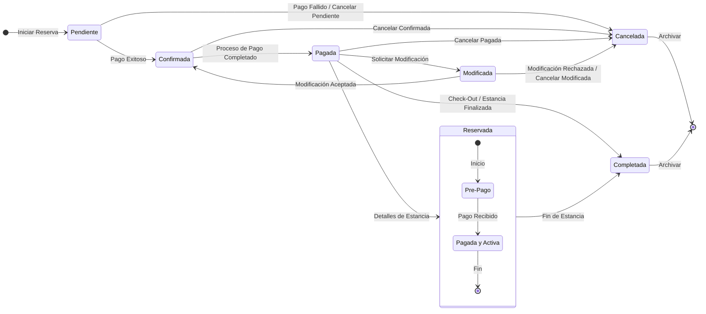

```mermaid

stateDiagram-v2
    direction LR

    [*] --> Pendiente : Iniciar Reserva

    Pendiente --> Confirmada : Pago Exitoso
    Pendiente --> Cancelada : Pago Fallido / Cancelar Pendiente

    Confirmada --> Pagada : Proceso de Pago Completado
    Confirmada --> Cancelada : Cancelar Confirmada

    Pagada --> Modificada : Solicitar Modificación
    Pagada --> Cancelada : Cancelar Pagada
    Pagada --> Completada : Check-Out / Estancia Finalizada

    Modificada --> Confirmada : Modificación Aceptada
    Modificada --> Cancelada : Modificación Rechazada / Cancelar Modificada

    Cancelada --> [*] : Archivar

    Completada --> [*] : Archivar

    state "Reservada" as R {
        state "Pre-Pago" as PP
        state "Pagada y Activa" as PA
        [*] --> PP : Inicio
        PP --> PA : Pago Recibido
        PA --> [*] : Fin
    }

    Pagada --> R : Detalles de Estancia
    R --> Completada : Fin de Estancia

```